<h1 style="text-align:center"> Caffè 500 </h1>

Caffè 500 is an Italian restaurant located in Carlow, preparing some of the best that authentic, Italian food has to offer. The website provides its users with valueable information about the restaurant such as its location, a sample menu, opening hours and a reservation page.

 

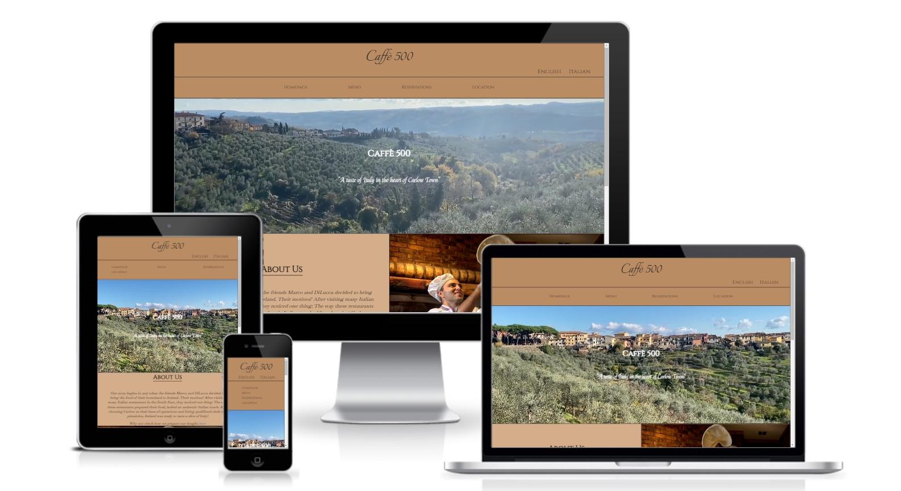

 

## Website's Content

 

### Header

 

Contains the logo and two language anchors: one for an English version of the page, and another for an Italian version. Each page is connected with its respective Italian/English version through these anchors.

 

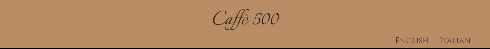

 

### Navbar

 

Here the user can find all four links to navigate through the website: Homepage, Menu, Reservations and Location.

 

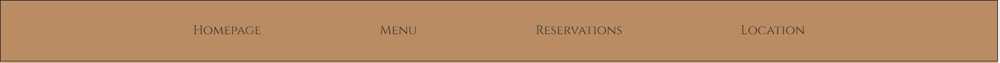

 

### Footer

 

The footer contains links to Facebook, Instagram and Tripadvisor, for the user to contact, and review the restaurant.

 

It also contains its the coypright.

 

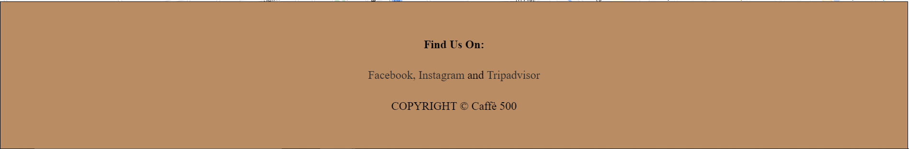

 

#### Homepage

 

The Homepage provides an informative page about the restaurant, displaying an 'About Us' section, opening hours, contact details and a map displaying the restaurant's location. 

 

It also contains a hero-video decorating the page with the name of the restaurant and a slogan.

 

##### Hero-Video

 

This section welcomes the user to the website with a strong statement about the business' principle.

 

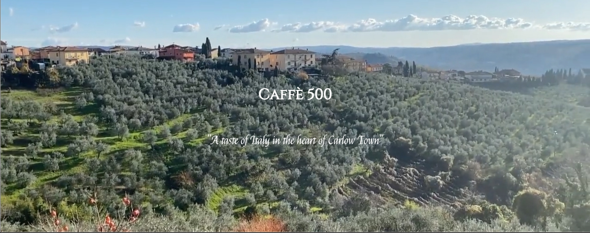

 

##### About Us

 

Here the user is introduced to how the business started and what motivated the owners to start it.

 

It also provides the user with an external link to their Instagram, where they talk about how their dough is prepared, differentiating them from other restaurants.

 

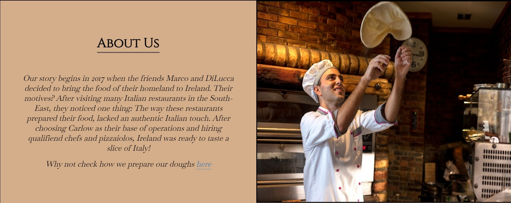

 

##### Info Section

 

In this section, the website is displayed with a fixed image, as if the contents were on top of one of the restaurant's tables. Here, the user is informed about their opening times, contact information and a link to the menu page.

 

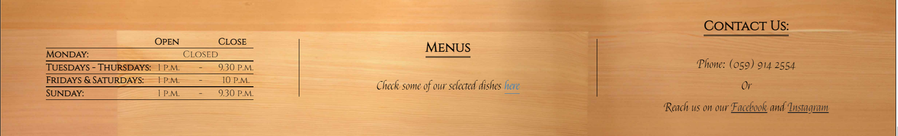

 

#### Menu

The menu page is rich with information on the selected dishes of the restaurant. It provides detailed description (including allergens) about five dishes in each food section: starters, pastas, pizzas and vegetarian options. But it also contains information on desserts, beverages and hot drinks.

 

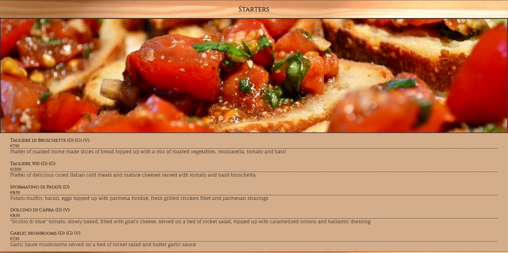

 

##### Info and Allergens

 

At the bottom of the page, the user can check which allergens certain dishes contain.

 

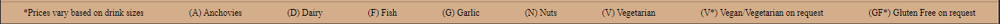

 

#### Reservations

 

In this page, the users can book a table after filling the required spaces in the reservation form provided to them. Which the click of a finger, they can guarantee a sit in an authentic Italian restaurant.

 

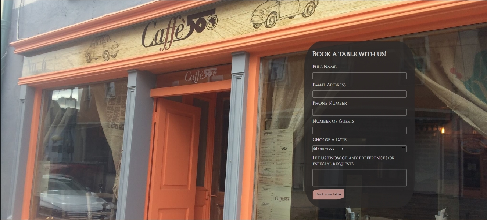

 

#### Location

This anchor elements bring the user straight to the map section of the homepage, regardless of which page they may be.

 

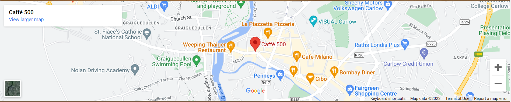

 

# Testing

 

Once the website was deployed I used the W3C Validator Services to check for errors and came across some minor errors that were easy to fix. This errors included:

Percentage set within the iframe element to define width and height. Despite making the map work as intended by me, corrected that by displaying the width and height withing a style property.

A closing </ul> that was not deleted together with the rest of the previous code that was initially being used on the footer.

A repeated h1 element in the menu pages for the "Sample Menu (V*) (GF*)" text.

Sections without h2-h6. The recomendation was to substitute the sections by divs, and that's what was done.

And, the biggest error I came across, and I noticed as soon as I deployed the website, was the starters image not displaying. After a while, I discovered that I had the image source coded as "/assets/images/starter.jpg" instead of "assets/images/starter.jpg". Removing the first / resolved the error.

As of this moment, there are no more errors in the code. 

## Extra:

There were some things that the testing tools did not notice, and I only noticed them after slowly proof reading every code block. Afterwards I had:

A few typos corrected.

Commented out code deleted.

A br added to between two dished, therfore, correcting the presentation of these two items.

# Deployment

Once I was in my repository page, accessed settings and scrolled down to the Pages option. There, I selected "main" as my branch.

Here is the link to my deployed website: https://renan-07.github.io/ristorante-italiano/

# Credits

https://alvarotrigo.com/blog/background-video-css/

I used this first source to help me with my hero video

https://www.youtube.com/watch?v=LQsjNmkqUOc

This second source helped me understand and apply ::before to my .info-container, so I could target only the background image.

https://code-institute-org.github.io/love-running-2.0/index.html

I used part of the code from the sign up form from Love Running as inspiration to create my own.

